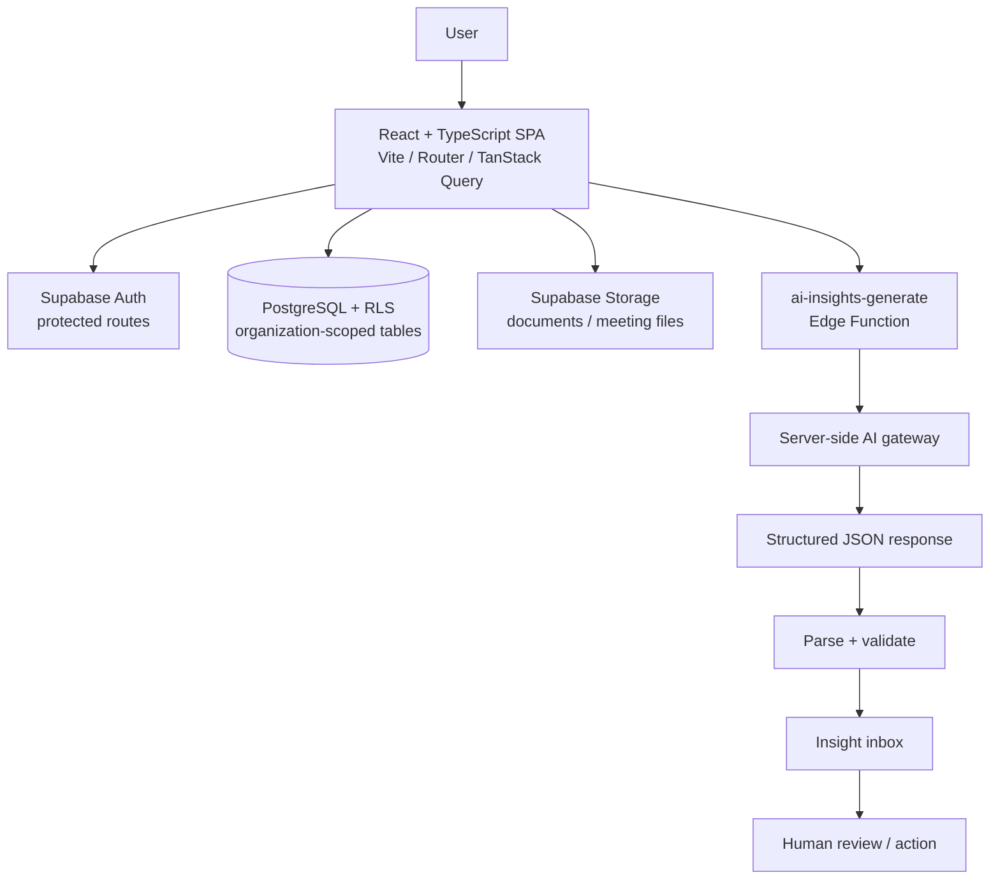

# Architecture

## System overview

Intelligent Office is a Vite-served React single-page application backed by Supabase. The browser owns presentation, routing, local UI state, and user interaction. Supabase provides authentication, PostgreSQL/PostgREST data access, storage, and Edge Functions. The primary engineering story is an authenticated workplace workflow that turns organization-scoped operational data into human-reviewed AI insights.



The same flow in plain language is:

```text
workplace data → context aggregation → Edge Function → server-side AI provider
→ structured response → parsing/validation → insight inbox → human action
```

## Frontend

The frontend uses React 18 and TypeScript with Vite as the build tool. React Router defines public and protected routes. TanStack Query is available for server-state coordination, while feature components use focused hooks and local state for loading, filters, forms, and optimistic interaction. Tailwind CSS, Radix/shadcn primitives, Framer Motion, and Recharts provide reusable UI, responsive layouts, motion, and data visualization.

`AuthProvider` listens to Supabase session changes. `ProtectedRoute` prevents unauthenticated access to workspace surfaces. `AppLayout` and shared dashboard components keep navigation and visual behavior consistent across execution, communication, meetings, documents, workflows, team, and AI Insights screens.

## Backend and database

There is no separate Node API server. Browser CRUD uses the generated Supabase client and PostgREST. Supabase migrations define relational tables, indexes, triggers, storage configuration, and Row Level Security policies. Organization IDs are carried through queries, while RLS is the database enforcement boundary for tenant isolation.

The central workflow reads from `profiles`, `organizations`, `tasks`, `kpis`, `attendance_records`, `channels`, and `messages`, then writes generated records to `ai_insights`. Supporting tables and functions cover activity logs, documents, meetings, workflows, and notifications.

Supabase Storage supports document and meeting-file flows. The client is compatible with realtime-oriented Supabase patterns, but the core AI showcase path is based on explicit queries and mutations rather than claiming broad realtime behavior that is not required by the workflow.

## Authentication and authorization

Supabase Auth manages email/password sign-in, sign-up, recovery, session refresh, and sign-out. The client persists sessions in browser local storage. Application hooks resolve organization membership and role information, while protected routes provide the user experience boundary. Deployed Row Level Security policies must enforce organization/user boundaries independently of the browser.

## AI layer

`AIInsightsModule` collects aggregate operational context for the current organization: staff count, task status and priority, overdue/blocked work, attendance participation, and KPI performance. It sends that context to `ai-insights-generate` through `supabase.functions.invoke`.

The Edge Function is the server-side provider boundary. It reads `AI_GATEWAY_URL` and `AI_GATEWAY_API_KEY` from Edge Function secrets, submits a constrained prompt requesting a JSON array, checks the upstream response, extracts the JSON array, validates the required fields and allowed severity values, and returns a structured response. The browser then persists insights and presents them for filtering, acknowledgement, resolution, or dismissal.

The function is intentionally not autonomous. AI output is advisory and human-reviewed. If the provider is unavailable or returns malformed output, the page uses deterministic local heuristics and displays an error toast where appropriate. This makes failure behavior explicit rather than presenting an unverified model response as fact.

## External services

Supabase is required for authenticated and persistent behavior. An OpenAI-compatible chat-completions gateway is optional for generated insights and is configured only through server-side Edge Function secrets. LiveKit, transcription, and email providers are optional supporting integrations and are not prerequisites for understanding the primary dashboard-to-insight workflow.

## Important design decisions

1. **Make the workflow inspectable.** A reviewer can trace data from dashboard queries to context aggregation, server-side AI, structured persistence, and human action.
2. **Keep secrets server-side.** Browser variables contain only Supabase browser-safe values; AI and service-role credentials are Edge Function secrets.
3. **Prefer structured output.** The AI contract is a small JSON schema rather than unbounded model text.
4. **Validate at the boundary.** The Edge Function rejects malformed upstream responses before they become application records.
5. **Preserve degraded behavior.** Deterministic local analysis keeps the feature understandable and testable when the provider is unavailable.
6. **Use RLS as the authorization boundary.** Client route guards improve UX but are not a substitute for database policies.

## Security considerations

The repository contains no service-role keys, AI keys, passwords, private tokens, production credentials, or private datasets. `.env.example` contains placeholders only. `VITE_*` variables are limited to browser-safe Supabase configuration. Server-only secrets must be configured through Supabase. AI prompts should contain aggregate workplace context and exclude unnecessary secrets or personal data.

## Scalability considerations

The dashboard currently performs parallel aggregate queries suitable for the showcase workflow. A larger deployment could move repeated metrics into database views/materialized aggregates, queue AI generation, add rate limiting and audit records, and introduce pagination and background jobs. Those are future engineering steps, not current performance claims.
